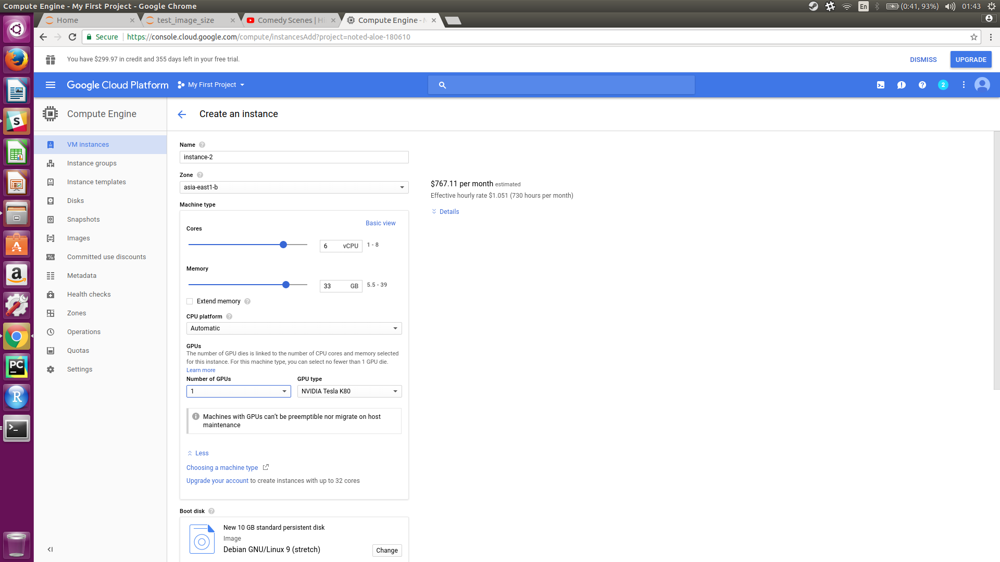

## Creating VM on Google Cloud
### Steps
- Go to [Google Cloud Website](https://cloud.google.com)
- Click on Try it Free
- Sign in with a google account
- Follow the instructions and after verification of credit or debit card account will be created

Once logged in to account create a new project  and select create instance from the menu with the configurations as follows : 

You can select configurations here and for GPUs select "customize" under "Machine Type". Be aware of the fact that GPUs are not available in all regions so you should select "asis-east1-b" or any other where GPUs are available and then select "GPUs" to attach one or more GPUs to the VM

After selecting your configurations click on "Create" and the VM will be created.

### VM instances are charged per minute / second, when the VM is on. So use it carefully and always shut it down after using.

After the VM is created. You can configure it by install GPU drivers and required libraries. A guide to do that is [here]("./README.md").